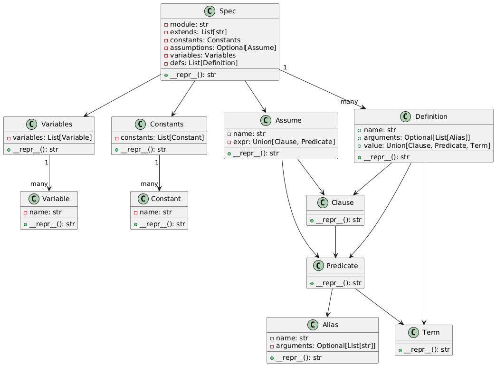

# TLA+ Abstract Syntax Tree (AST) Representation

This repository contains a Python implementation of an Abstract Syntax Tree (AST) designed to represent the syntax of TLA+ specifications. The AST provides a structured way to parse, analyze, and manipulate TLA+ specifications programmatically.

## Overview of the AST

The AST implemented in the `src` folder is designed to represent the hierarchical structure of TLA+ specifications. Each node in the AST corresponds to a syntactic construct in TLA+, such as modules, constants, variables, definitions, and expressions.

### Key Features

- **Modularity**: Each TLA+ construct (e.g., `Conjunction`, `Constant`, `Definition`, `Expression`) is represented as a distinct class.
- **Hierarchical Representation**: The AST captures the nested structure of TLA+ specifications, allowing for easy traversal and manipulation.
- **Extensibility**: The implementation is designed to be extensible, making it easy to add support for new TLA+ constructs.


## How the AST Works

The AST is built using a set of Python classes, each representing a specific TLA+ construct. Below is an explanation of the main components of the AST.


{ width=50% }


### 1. Specifications

#### `Spec` Class

Represents an entire **TLA+ module** as an abstract syntax tree (AST). This class serves as the top-level node in the tree and is responsible for rendering a valid TLA+ specification string.

> ⚠️ **Note**: The validity of the generated TLA+ code depends on the internal consistency and correctness of the tree, especially when using aliases or user-defined names.

##### Example

```python
spec = Spec(
    module="MyModule",
    extends=["Naturals", "Sequences"],
    constants=Constants([Constant("N")]),
    assumptions=None,
    variables=Variables([Variable("x"), Variable("y")]),
    defs=[...]
)

print(repr(spec))
```

##### Output Representation

Calling `repr()` on a `Spec` object returns the full TLA+ module as a formatted string:

```
------------------------ MODULE MyModule ------------------------
EXTENDS Naturals, Sequences
CONSTANTS N

VARIABLE x, y

<definitions here>

=============================================================================
```

### 2. Constants and Variables

The constants and variables of the specification are represented as `Constants` and `Variables` nodes, respectively. These nodes store metadata about the constants and variables declared in the specification.

---

#### `Constants` Class

Represents the `CONSTANTS` declaration in a TLA+ specification.

##### Constructor

```python
Constants(constants: List[Constant])
```

- **constants**: A list of `Constant` objects, each representing a declared constant.

##### Example

```python
from src.ast.constants import Constants
from src.definitions.terms.terms import Constant

c1 = Constant("A")
c2 = Constant("B")
consts = Constants([c1, c2])
print(repr(consts))  # Output: CONSTANTS A, B
```

##### Output Representation

Calling `repr()` on a `Constants` object returns the corresponding TLA+ `CONSTANTS` line as a string:
```
CONSTANTS A, B
```

---

#### `Variables` Class

Represents the `VARIABLES` declaration in a TLA+ specification.

##### Constructor

```python
Variables(variables: List[Variable])
```

- **variables**: A list of `Variable` objects, each representing a declared variable.

##### Example

```python
from src.ast.variables import Variables
from src.definitions.terms.terms import Variable

v1 = Variable("x")
v2 = Variable("y")
vars = Variables([v1, v2])
print(repr(vars))  # Output: VARIABLES x, y
```

##### Output Representation

Calling `repr()` on a `Variables` object returns the corresponding TLA+ `VARIABLES` line as a string:
```
VARIABLES x, y
```

### 3. Definitions

The `Definition` class represents `Name == Expression` constructs in TLA+, optionally with parameters. These definitions correspond to user-defined operators or macros declared in a TLA+ module.

#### `Definition` Class

```python
Definition(
    name: str,
    value: Union[Clause, Predicate],
    arguments: Optional[List[str]] = None
)
```

- **name**: The identifier being defined.
- **value**: The body of the definition, either a `Clause` or a `Predicate`.
- **arguments** *(optional)*: A list of argument names if the definition is parameterized.

#### Example

```python
Definition("MyOp", Predicate("x > 0"), ["x"])
```

Renders as:
```
MyOp(x) == x > 0
```

---

### 4. Temporal Logic Operators

These classes represent temporal constructs in TLA+, which describe how properties evolve across system states. All of them inherit from the `TemporalOperator` base class and implement `__repr__()` to match TLA+ syntax.

#### `Box` (`[]`)

```python
Box(term: Term)
```

Represents the **"always"** operator `[]A`, meaning the formula `A` holds in all states of the system.

```python
Box(Predicate("x > 0"))  # renders: []x > 0
```

#### `Diamond` (`<>`)

```python
Diamond(term: Term)
```

Represents the **"eventually"** operator `<>A`, meaning the formula `A` holds in some state.

```python
Diamond(Predicate("x = 0"))  # renders: <>x = 0
```

#### `FrameCondition` (`[A]_v`)

```python
FrameCondition(action: Term, variables: List[Term])
```

Represents `[A]_v`, which asserts that either the action `A` occurs or the variables `v` remain unchanged between states.

```python
FrameCondition(Predicate("x' = x + 1"), [Term("x")])
# renders: [x' = x + 1]_<<x>>
```

#### `WeakFairness` (`WF_v(A)`)

```python
WeakFairness(action: Term, variables: List[Term])
```

Encodes the weak fairness constraint `WF_v(A)`, meaning the action `A` must eventually occur if it's continuously enabled.

```python
WeakFairness(Predicate("x' = x + 1"), [Term("x")])
# renders: WF_<<x>>(x' = x + 1)
```

Great! Let's start by documenting the **Predicates** and **Clauses** sections clearly and concisely. Here's a markdown section you can add to your `README.md`:

---

### 5. Predicates and Clauses

In this AST implementation, **Predicates** represent boolean-valued expressions that do not involve logical connectives like conjunction or disjunction. **Clauses**, on the other hand, are logical formulas constructed from predicates and other clauses using logical operators.

#### Predicates

Predicates evaluate to `TRUE` or `FALSE`, and are typically the building blocks for logical expressions in TLA+. They support common relational and set operations as well as quantifiers:

| Class | Description |
|-------|-------------|
| `TRUE`, `FALSE` | Boolean constants. |
| `Not` | Logical negation. |
| `UniversalQuantifier` | ∀ quantifier over a set: `∀ x ∈ S: P(x)`. |
| `ExistentialQuantifier` | ∃ quantifier over a set: `∃ x ∈ S: P(x)`. |
| `Equals`, `NotEquals` | Binary predicates for equality and inequality. |
| `LessThan`, `LessThanEquals`, `GreaterThan`, `GreaterThanEquals` | Arithmetic comparison predicates. |
| `In` | Set membership: `x ∈ S`. |
| `SubsetEquals` | Subset equality: `A ⊆ B`. |

Example:
```python
Equals(x, y)        # ((x) = (y))
Not(In(x, S))       # ~(x ∈ S)
UniversalQuantifier([x], S, Predicate(...))
```

---

#### Clauses

Clauses are higher-level logical combinations of predicates or other clauses using connectives:

| Class | Description |
|-------|-------------|
| `Conjunction` | Logical AND: `P ∧ Q ∧ ...`. |
| `Disjunction` | Logical OR: `P ∨ Q ∨ ...`. |
| `Implication` | Logical implication: `P ⇒ Q`. |

Example:
```python
Conjunction([Equals(x, y), In(x, S)])  
# ((x) = (y)) /\ (x ∈ S)

Implication(Predicate(...), Predicate(...))
# P => Q
```

Clauses allow nesting, so you can build arbitrarily complex logical formulas.

### 6. Terms

In TLA+, **Terms** are expressions that represent values, variables, constants, and more complex data structures. Below is a breakdown of the supported term types.

#### Basic Term Types

| Class       | Description |
|-------------|-------------|
| `Scalar`    | Represents a scalar value (a constant in mathematical logic). |
| `Variable`  | Represents a variable, as defined in TLA+ under `VARIABLES`. |
| `Constant`  | Represents a constant, as defined in TLA+ under `CONSTANTS`. |
| `String`    | Represents a string value. |
| `Alias`     | Represents an alias for a definition. |
| `Function`  | A generic class for terms that take one or more terms as arguments and return another term. |
| `Unchanged` | Represents the `UNCHANGED` operator in TLA+. |
| `Choose`    | Represents the `CHOOSE` operator in TLA+. |
| `Enabled`   | Represents the `ENABLED` operator in TLA+. |
| `Range`     | Represents a range of values in TLA+ (e.g., `start..end`). |

Example:
```python
x = Scalar(5)
v = Variable("x")
c = Constant("MAX")
s = String("Hello")
```

---

#### Arithmetic Operations

TLA+ supports arithmetic operations. These operations are implemented as subclasses of `Function`:

| Class       | Description |
|-------------|-------------|
| `Addition`  | Represents the addition operation between two terms. |
| `Substraction` | Represents the subtraction operation between two terms. |
| `Multiplication` | Represents the multiplication operation between two terms. |
| `Division` | Represents the division operation between two terms. |

Example:
```python
term1 = Scalar(3)
term2 = Scalar(4)
result = Addition(term1, term2)  # Represents 3 + 4
```

---

#### Record and Mapping Operations

These terms are used to define and work with records and mappings in TLA+:

| Class       | Description |
|-------------|-------------|
| `Record`    | Represents a record, a collection of named fields with associated types. |
| `RecordInstance` | Represents an instance of a record, with assigned values for each field. |
| `Mapping`   | Represents a function mapping, where a set of input values is mapped to output values. |

Example:
```python
record = Record(fields=["name", "age"], types=[String("John"), Scalar(30)])
record_instance = RecordInstance(fields=["name", "age"], vals=[String("Alice"), Scalar(25)])
mapping = Mapping(vals=[Scalar(1), Scalar(2)], funs=[Scalar(10), Scalar(20)])
```

---

#### Set Operations

TLA+ also supports a variety of operations for manipulating sets:

| Class       | Description |
|-------------|-------------|
| `IndexSet`  | Represents the indexing operation of a set (e.g., `set[index]`). |
| `Subset`    | Represents a subset of a set. |
| `Set`       | Represents a set of elements. |
| `SetOf`     | Creates a set of elements from a subset that satisfies a predicate. |
| `SetFrom`   | Creates a set of elements based on a predicate. |
| `SetExcept` | Creates a set with an entry changed (e.g., `set EXCEPT ![index] = value`). |
| `Cardinality` | Returns the cardinality (number of elements) of a set. |
| `Union`     | Returns the union of two sets. |
| `Intersection` | Returns the intersection of two sets. |

Example:
```python
set1 = Set([Scalar(1), Scalar(2), Scalar(3)])
set2 = Set([Scalar(3), Scalar(4), Scalar(5)])
union_set = Union(set1, set2)  # Represents {1, 2, 3} ∪ {3, 4, 5}
```

---

## Getting Started

### Prerequisites

- Python 3.8 or higher

### Installation

Clone the repository:

```bash
git clone https://github.com/your-username/your-repo-name.git
cd your-repo-name
```
To run the examples:

```bash
python3 examples.py